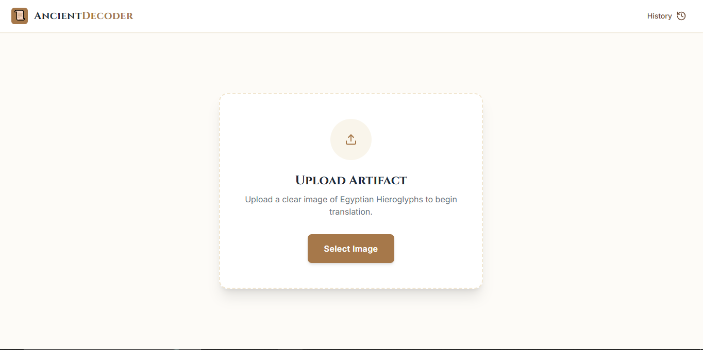
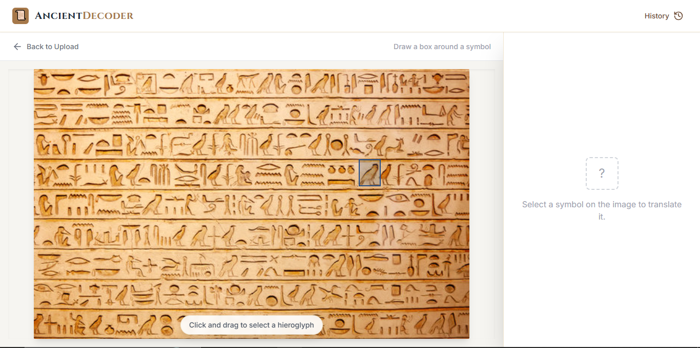
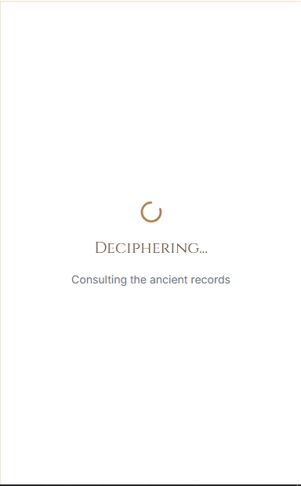
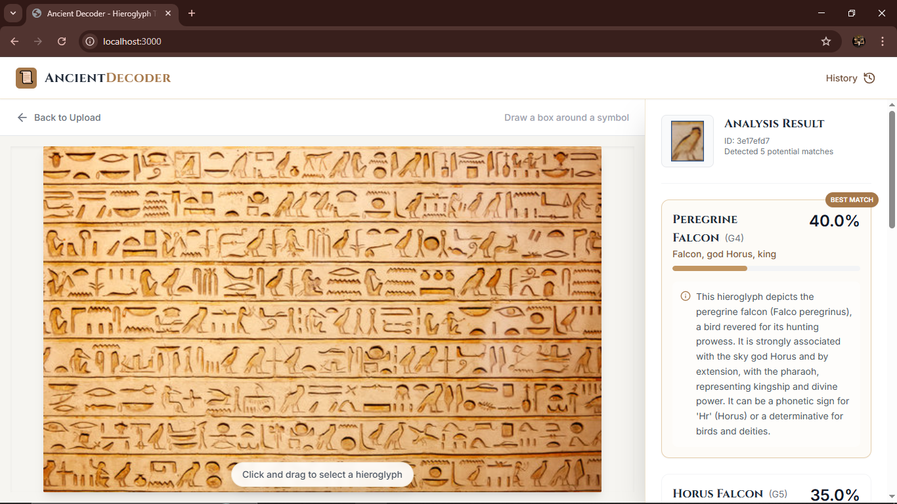

# 🏺 Ancient Decoder
### **AI-Powered Hieroglyph Recognition & Translation**

|               |
|---|

## 📌 Overview  
**Ancient Decoder** is an AI-powered system that recognizes **Egyptian hieroglyphs** from scanned images and translates them into **English** using a hybrid approach combining a trained deep learning model with Google's Gemini AI.

**Workflow:**
1. Upload an image containing hieroglyphs
2. Crop/select individual symbols using the interactive canvas
3. System tries trained PyTorch model first (EfficientNetV2-S)
4. If successful, enriches results with Gemini AI for detailed meanings
5. If model fails, falls back to full Gemini analysis
6. Displays top-5 predictions with:
   - Gardiner Code
   - Symbol name
   - English meaning
   - Confidence score
   - Historical description

Built for researchers, students, historians, and anyone fascinated by ancient scripts.

---

## ✨ Features  
- 📤 **Image Upload** - Upload images containing hieroglyphs
- ✂️ **Interactive Cropping** - Draw bounding boxes to select individual symbols
- 🤖 **Hybrid AI System** - Combines trained PyTorch model with Gemini AI
- 🏷️ **Rich Information** - Shows Gardiner code, symbol name, meaning, and descriptions
- 📊 **Confidence Scores** - Visual probability bars for each prediction
- 📜 **History Tracking** - Saves last 20 translations in browser storage
- ⚡ **Fast & Responsive** - Smooth React UI with real-time feedback
- 🔄 **Automatic Fallback** - Seamlessly switches to Gemini if model fails

---

## 🧠 Tech Stack  

### **Frontend**
- **React 19** - Modern UI framework
- **TypeScript** - Type-safe development
- **Vite** - Fast build tool and dev server
- **TailwindCSS** - Utility-first CSS framework
- **Lucide React** - Icon library
- **Google Gemini API** - AI-powered translation and enrichment

### **Backend**
- **FastAPI** - Modern Python web framework
- **PyTorch 2.1.0** - Deep learning framework
- **EfficientNetV2-S** - Pre-trained model architecture (fine-tuned for hieroglyphs)
- **Torchvision** - Image preprocessing utilities
- **Pillow** - Image processing

---

## 🚀 System Architecture  

```
User Uploads Image
       ↓
Crop Symbol (Interactive Canvas)
       ↓
Frontend sends to Backend API
       ↓
┌──────────────────────────────┐
│  PyTorch Model (Primary)     │
│  - EfficientNetV2-S         │
│  - Returns Gardiner codes    │
│  - Confidence scores         │
└──────────────────────────────┘
       ↓
   Success? (confidence ≥ 0.1)
       ↓
   ┌──────┴──────┐
   YES          NO
   ↓            ↓
Gemini      Gemini
Enrichment  Full Analysis
   ↓            ↓
   └──────┬──────┘
       ↓
Display Results
(Gardiner Code + Meanings)
```

### **Key Components:**
1. **Backend Model** - EfficientNetV2-S trained on 150+ hieroglyph classes
2. **Gemini Enrichment** - Adds symbol names, meanings, and historical context
3. **Fallback System** - Automatic switch to Gemini if model fails or confidence is low

---

## 📂 Project Structure  

```
ancient-decoder/
├── backend/
│   ├── main.py                 # FastAPI server + model inference
│   ├── model/
│   │   └── EfficientNetV2-S_best_model2.pth  # Trained model weights
│   └── requirements.txt        # Python dependencies
├── components/
│   ├── Header.tsx              # Navigation header
│   ├── ImageCanvas.tsx         # Interactive image cropping canvas
│   ├── ResultsPanel.tsx        # Prediction results display
│   └── Icons.tsx               # Icon components
├── services/
│   └── translationService.ts   # Backend + Gemini integration logic
├── types.ts                    # TypeScript type definitions
├── App.tsx                     # Main React component
├── index.tsx                   # React entry point
├── index.html                  # HTML template
├── vite.config.ts              # Vite configuration
├── package.json                # Node.js dependencies
└── README.md                   # This file
```

---

## 🛠️ Installation & Setup  

### **Prerequisites**
- Python 3.9+
- Node.js 18+
- Google Gemini API Key ([Get one here](https://makersuite.google.com/app/apikey))

### **1️⃣ Clone the Repository**
```bash
git clone https://github.com/Keerthan-17/ancient-decoder
cd ancient-decoder
```

### **2️⃣ Backend Setup**

```bash
cd backend
pip install -r requirements.txt
```

**Start the backend server:**
```bash
uvicorn main:app --reload
```

The backend will run on `http://localhost:8000` and automatically load the trained model on startup.

**Verify backend is running:**
```bash
curl http://localhost:8000/health
```

### **3️⃣ Frontend Setup**

**Install dependencies:**
```bash
npm install
```

**Create environment file:**
Create a `.env` file in the root directory:
```env
GEMINI_API_KEY=your_gemini_api_key_here
```

**Start the development server:**
```bash
npm run dev
```

The frontend will run on `http://localhost:3000`

### **4️⃣ Access the Application**
Open your browser and navigate to `http://localhost:3000`

---

## 🔧 Configuration

### **Environment Variables**

Create a `.env` file in the root directory:

```env
GEMINI_API_KEY=your_google_gemini_api_key
```

### **Backend Configuration**

To use a different model, edit `backend/main.py`:

```python
# Line 50: Change model architecture
model = models.efficientnet_v2_s(weights=None)

# Line 55: Change model path
model_path = "model/your_model.pth"
```

### **Model Confidence Threshold**

Adjust the minimum confidence threshold in `services/translationService.ts`:

```typescript
const MIN_CONFIDENCE_THRESHOLD = 0.1; // Change this value (0-1)
```

---

## 📖 API Endpoints

### **Backend (FastAPI)**

- `GET /` - API information
- `GET /health` - Health check and model status
- `POST /predict-base64` - Predict hieroglyph from base64 image
- `POST /predict` - Predict hieroglyph from file upload

### **Example Request**
```bash
curl -X POST "http://localhost:8000/predict-base64" \
  -H "Content-Type: application/json" \
  -d '{"image": "data:image/png;base64,..."}'
```

---

## 🖥️ Screenshots





- **Home page** – Upload interface
- **Crop tool** – Interactive symbol selection
- **Prediction results** – Top-5 predictions with meanings and confidence scores

---

## 🎯 Use Cases

- **Education** - Learn hieroglyph translation interactively
- **Research** - Archaeology and historical research tools
- **Museums** - Digital interpretation assistants
- **Language Study** - AI-powered ancient script learning
- **Digital Preservation** - Modern tools for ancient scripts

---

## 🔍 How It Works

1. **Image Processing**: User uploads an image and selects a hieroglyph symbol
2. **Model Inference**: Backend runs EfficientNetV2-S model to classify the symbol
3. **Gardiner Code Prediction**: Model returns top-5 Gardiner codes with confidence scores
4. **AI Enrichment**: Gemini AI adds symbol names, meanings, and historical descriptions
5. **Fallback**: If model fails or confidence is low, Gemini performs full analysis
6. **Results Display**: Frontend shows formatted results with visual confidence indicators

---

## 🧪 Model Details

- **Architecture**: EfficientNetV2-S (Small)
- **Classes**: 150+ hieroglyph symbols (Gardiner codes)
- **Input Size**: 224x224 RGB images
- **Training**: Fine-tuned on curated hieroglyph dataset
- **Output**: Top-5 predictions with confidence scores

---

## 🤝 Contributing  
Contributions are welcome! 🎉  

1. Fork the repository
2. Create a feature branch (`git checkout -b feature/amazing-feature`)
3. Commit your changes (`git commit -m 'Add amazing feature'`)
4. Push to the branch (`git push origin feature/amazing-feature`)
5. Open a Pull Request

---

## 📜 License  
This project is MIT Licensed.  
Users must comply with **Google Gemini API terms of service** and any **third-party dataset licenses**.

---

## 🙏 Acknowledgments

- **Google Gemini** - For AI-powered translation and enrichment
- **PyTorch Team** - For the deep learning framework
- **FastAPI** - For the excellent Python web framework
- **React Team** - For the UI framework

---

## 💡 Inspiration  
This project was built as a **Final Year Engineering Project** 🏫 with the aim of blending **AI + History + Accessibility** - making ancient Egyptian hieroglyphs accessible through modern technology.

---

## 📞 Support

For issues, questions, or contributions, please open an issue on GitHub or contact the maintainers.

---

**Made with ❤️ for ancient script enthusiasts**
