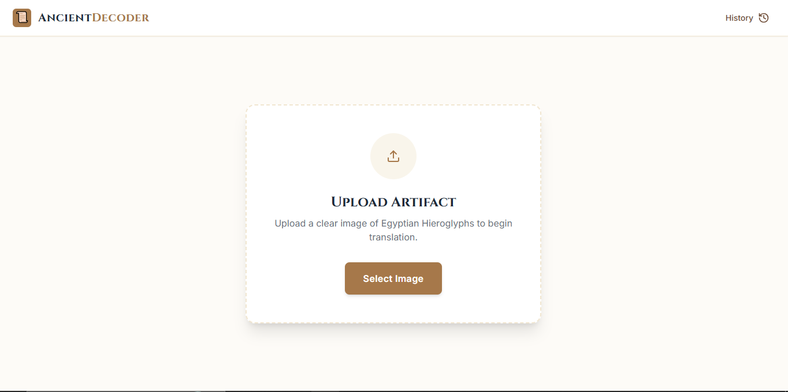
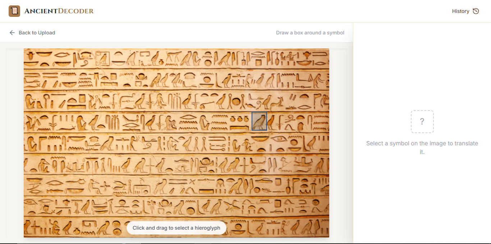
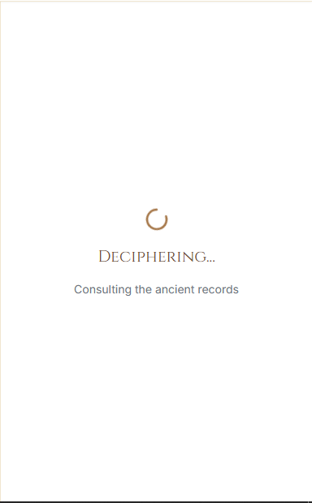
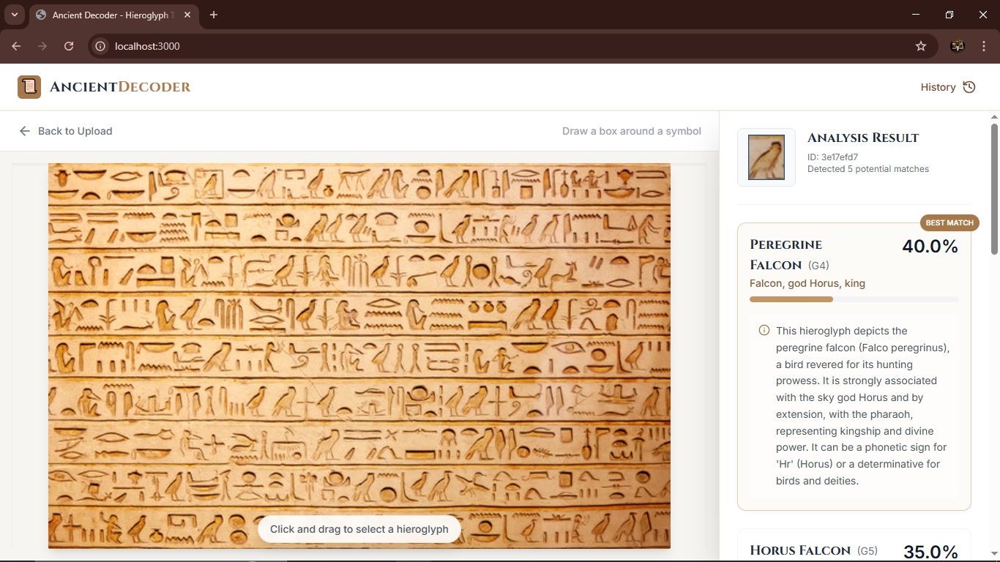

# 🏺 Ancient Script Decoder  
### **AI-Powered Hieroglyph Recognition & Translation**

|             |
---

## 📌 Overview  
**Ancient Script Decoder** is an AI-powered system that recognizes **Egyptian hieroglyphs** from scanned images and translates them into **English** using a deep learning model trained on curated hieroglyph datasets.

Upload an image → Crop a symbol → The AI predicts top-5 matching hieroglyphs → Displays:  
- Gardiner Code  
- English meaning  
- Confidence score  

Built for researchers, students, historians, and anyone fascinated by ancient scripts.

---

## ✨ Features  
- 📤 Upload images containing hieroglyphs  
- ✂️ Crop/select individual symbols  
- 🤖 AI model predicts Top-5 matches  
- 🏷️ Shows Gardiner code + English meaning  
- 📊 Displays confidence score for each prediction  
- ⚡ Smooth React + Python integration  
- 🔍 Fast similarity search using embeddings  

---

## 🧠 Tech Stack  

### **Frontend**
- React  
- TailwindCSS  
- React Image Crop  

### **Backend**
- FastAPI  
- Python  
- PyTorch  
- FAISS / Cosine Similarity  

### **ML / Data**
- Custom image embedding model  
- Hieroglyph dataset  
- Symbol metadata (CSV)  

---

## 🚀 System Architecture  
1. User uploads & crops symbol  
2. Backend preprocesses image  
3. Model generates vector embeddings  
4. Similarity search finds closest symbols  
5. Metadata (meaning + code) returned  

---

## 📂 Project Structure  

```
ancient-decoder/
├── frontend/ # React UI
├── backend/ # FastAPI backend + model
├── model/ # Model weights
├── dataset/ # Symbol data + metadata
└── README.md
```
---

## 🛠️ Installation & Setup  

### **1️⃣ Clone the Repository**
```bash
git clone https://github.com/Keerthan-17/ancient-decoder
cd ancient-decoder
```
### **2️⃣ Backend Setup**
```bash
cd backend
pip install -r requirements.txt
uvicorn main:app --reload
```
### **3️⃣ Frontend Setup**
```bash
cd frontend
npm install
npm start
```
---

## 🖥️ Screenshots





- Home page – upload page
- Crop tool – select symbol
- Prediction result – meanings + top predictions

---

## 🎯 Use Cases

- Hieroglyph translation education
- Archaeology research tools
- Museum interpretation assistants
- AI-powered language study apps
- Digital preservation of ancient scripts

---

## 🤝 Contributing  
Contributions are welcome! 🎉  
1. Fork the repo  
2. Create a feature branch  
3. Commit changes  
4. Open a pull request  

---

## 📜 License  
This project is MIT Licensed.  
Users must still comply with **third-party dataset / API provider terms**.  

---

## 💡 Inspiration  
This project was built as a **Final Year Engineering Project** 🏫 with the aim of blending **AI + History + Accessibility**.
